# Welcome to Smart Dorm/Home Security 

  

**Video link:**  

**Progress report link:** [Progress Report](https://12740ae.github.io/progress-report/)

## 1. Introduction

### 1.1 Motivation

Dorm rooms and college shared-living spaces are unfortunately common settings for theft. They usually have minimal security, if any, but college students store a plethora valuables here: laptop, phone, passport/SS card, cash, electronics, gaming platforms, just to name a few. Sometimes a simple door lock is not enough to deter the average thief- and what if the thief is a cohabitant? Burglary incidents vary between colleges, but in some cases, victims can be as common at 13% of the student population. Consumer Report even provides reviews on dorm insurance, and homeowners policies can also be extended to children on a college campus. Improving dorm room/living space security and oversight is important and a key step to prevent the ubiquitous issue of thievery. 

### 1.2 Goals

We are interested in using sensors to help us learn about the security of our living spaces by providing remote ways to monitor our front doors.

Our objective is to achieve the following with sensors:

  1.）Tell the user when the door is opened and closed
  
        （a）Also play music when the door is opened to welcome users home
        
  2.)Tell users when and if the door has been completely and successfully locked

It will be important to maintain a record of time/date so if there is an intruder, a user can specify the time and date of when the crime took place. Additionally, individuals who live together can compare the timestamps to identify if there is an intruder by verifying the timestamps with their own knowledge of when they enter/exited the space. 

Additionally, many students agree that it would give them peace of mind to see that the door is indeed locked as they leave the property. Sometimes, we can even forget to lock the door. By uploading the status to OpenChirp in order to signify that the door is locked, a person at school or office can verify that they did indeed lock the door. 

## 2. Methodology

### 2.1 Phenomena of Interest

**Acceleration**

*Physical Principles*

With the accelerometer, we are measuring acceleration, or change in velocity of an object. Acceleration, in physics, is a vector quality and has a direction and magnitude as a result. Change in either the direction or magnitude will result in positive or negative acceleration. 

Acceleration is measured in g or G, which is equal to about 32.2 feet per second[2]. The g provides a measure of stress that a body would experience if it was accelerated at so many times the Earth’s gravitational pull. To give a frame of reference, the average playground swing can produce about 2g, or two times the earth’s gravitational force at the bottom of the swing path. In our scenario, closing a door leisurely or even slamming it would produce around the same amount of g at the edge of the door where the moment arm (from the door hinge as the pivot point) is the greatest, and so are the forces acting on the door. 

*Signal Characteristics and Static/Dynamic Behavior*

Acceleration is found mainly as gravity or the result of a net force. Acceleration from gravity is a (fairly- since gravity technically varies at different times and places) static physical property that all items exhibit when there isn’t a normal force to neutralize the Earth’s gravitational pull. Static acceleration as gravity can be used to measure if an object of interest is stationary but tilting. Dynamic acceleration is observed when a net force is applied to an object, causing time-varying change in direction or velocity, such as in the case of the object in motion or experiencing vibrations.

**Infrared Radiation**

*Physical Principles*

Infrared or IR is a kind of radiation emitted by almost all objects, and is emitted as heat energy. It’s part of the electromagnetic (EM)  spectrum, which also includes gamma-rays, x-rays, UV radiation and visible light[3]. EM radiation is created by electric and magnetic oscillation fields perpendicular to each other as well as charged particles traveling in space[4]. 

*Signal Characteristics and Static/Dynamic Behaviors*

IR frequencies range between 3 GHz and up to 400 THz, and wavelengths between 1000 micrometers and 760 nanometers for each complete cycle. The unit of measurement is most commonly the wavelength, in micrometers. IR radiation emitted by humans is steadily within .75 to 1000 micrometer and averages at 12 micrometers, all of which are values around the median of the IR spectrum. For warm-blooded animals, including humans, the main form of IR radiation produced would be in the form of thermal radiation[5].

IR radiation is a fairly dynamic phenomena. IR as heat and less obvious forms of radiation are found in everything from household heating appliances such as toasters to communication signals between the TV and its remote controller. In perfectly insulated environments, it is possible to maintain a level of IR radiation so it may behave statically, however, this is an idealized situation that is seldom found in the natural world.

**Visible Light**

*Physical Principles*

Visible light is also part of the electromagnetic spectrum, at higher frequencies that IR radiation discussed previously. As shown in Figure 1, the wavelengths for visible light range between 400 -700 nm, and the most common measurement for visible light is its wavelength, in nanometers. All waves in the electromagnetic spectrum travel as the speed of light, commonly known as coefficient c.  

  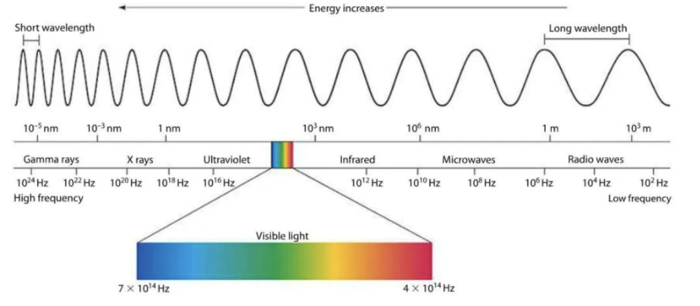

 Figure 1: Diagram showing the entire electromagnetic spectrum[6]

*Signal Characteristics and Static/Dynamic Behaviors*

Light has natural and artificial sources, including the Sun, fluorescent lamps, incandescent bulbs, LEDs and so on. Most light sources use the at least some part of the full spectrum of visible light but may be skewed towards particular wavelengths of light (Figure 2). Natural light does contain the full spectrum.

  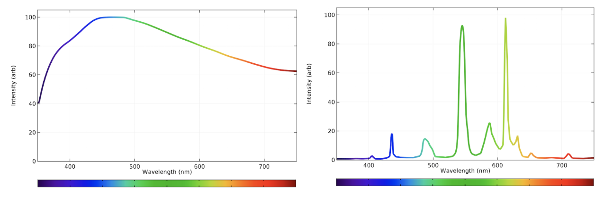

Figure 2 : Emission spectrum analysis showing intensity of each wavelength in visible light spectrum for natural light (left), and incandescent light (right)[7]

The average spectra observed may be different as a result from the skewed/favoring behavior of different light sources. When light is emitted at a wavelength, the signal characteristics (wavelength, amplitude, frequency, speed) are static, unless the positioning of the light source or the light source itself is modified. 

Another characteristic of visible light is light intensity. Light is measured with respect to direction and strength. Luminous flux is the “total amount of light emitted in all directions by a light source”, and is measured in lumens. Luminous intensity is also called luminance, and described by the strength of the light visible to the human eye. Luminance is measured in candela or lumens/steridian to represent intensity of the light through a unit area of the light source’s surface (i.e. the light bulb surface). Illuminance on the other hand, is measured in lux and describes the amount of light being projected/reflected onto a given surface area (such as is the case in indirect light)[9].

**Distance**

*Physical Principles*

Physical distance can use an array of measurements that provide some approximation of the space between at least two entities. It most commonly has units in feet-inches and meters.

*Signal Characteristics and Static/Dynamic Behaviors*

Distance can be dynamic if the position of any entities are moved; differential distance, or distance that changes with respective to time is derived as velocity. If no work is done in a system, the distance between entities is usually static. 

**Force**

*Physical Principles*

Force is the “push or pull upon an object resulting from the object’s interaction with another object”[10]. The unit of force is the Newton, which is equal to 1 kg-m/s2, representing the relationship of force as the driving entity behind a 1 kg mass accelerating at 1 m/s2. From modern kinematics, force is presented as a vector quality with a magnitude and direction. 

*Signal Characteristics and Static/Dynamic Behaviors*

Dynamic and static forces are represented in physical systems as bodies in motion or still. For example, a ball rolling along a plank exerts gravitational force (weight) across the length of the plank, so the load varies over time.

 A static load is constant over time, such as a ball sitting still at the end of the plank. Under static, unchanging force, a body can only respond by being displaced, while dynamic forces acting on a body can change the body’s displacement, velocity, and acceleration (these are time varying)[11].

## Sensors Used

**Accelerometer**

**Model: ADXL 335**

*Physical Principles*

The accelerometer used has small capacitive plates within the chip, creating a differential capacitor. Differential capacitance is described mathematically as follows:

 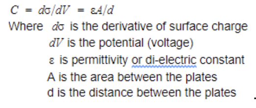 Equation1
 
 Capacitors are traditionally made with two conductive plates separated by a dielectric (in this case, this is air, as shown in Figure 3 below). Capacitance is the use of these plates to store charge, and is measured in Farads. The surface charge as described in Equation 1 is often referred to as Q, and is directly related to the voltage, or potential difference (measured in volts) across the plates. If voltage is increased, the charge stored between the plates, measured in Coulombs,also increases. 
 
 

  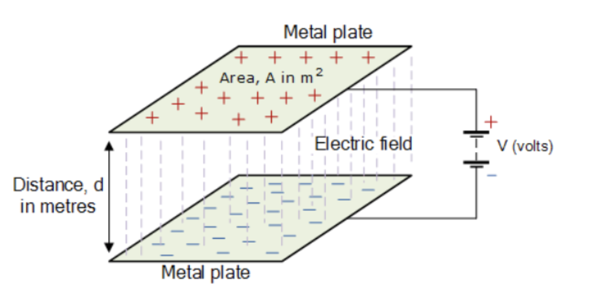

Figure 3: Diagram of a capacitor that can store positive and negative charges with respect to the source voltage[13]

A set of capacitive plates is fixed while another set is attached to a polysilicon structure suspended above the first set with polysilicon springs. As the chip is accelerated, the spring-mounted capacitive plates are also accelerated. The springs will resist the acceleration in both positive and negative directions of travel with the following equation:

 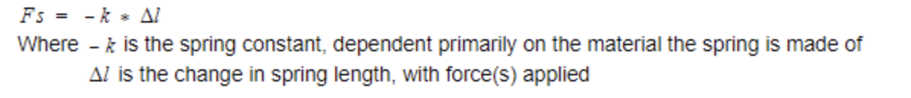 
 
To better understand the physics and relationships of an accelerometer like the ADXL 335, it is assumed that only the spring force and gravity are acting in the system. The system’s free-body diagram for the top capacitive plate in the sensor would be as follows in Figure 4:

  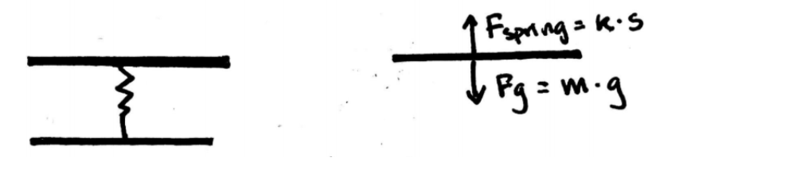

Figure 4: Free body diagram for capacitive accelerometer to understand relationships between components of sensor. The two plates separated by a spring represent the conductive plates in each sensor capacitor. 

The spring force is the normal force which resists the gravitational force resulting from the mass of the plate at rest. 

 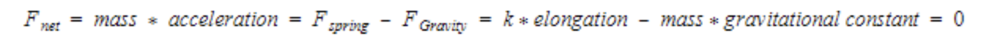 
 
When an additional force is applied and causes the sensor to accelerate, the spring would elongate/contract. Subsequently, as the length of the spring changes, the distance between the capacitive plates also changes (depending on the direction of acceleration), which changes capacitance according to Equation 1. Differential capacitance causes change in voltage, which is read as a raw output by the Raspberry Pi. 
 
*Signal Characteristics & Static/Dynamic Behaviors*

The signal output of the sensor is analog, as voltage.The sensor has three separate capacitors for each axis in the x, y, and z direction as indicated on the chip. To better understand the sensor’s capabilities, design practices, expected output/performance and possible environmental factors, we refer to the accompanying datasheet for the ADXL335 which lists specifications for input 3V, air temperature 25 degrees Celsius, and capacitance of each capacitor at 0.1 micro-Farad. 

A accelerometer may behave dynamically depending on environmental factors, such as temperature, and inputs, such as observed acceleration and source voltage. To establish a baseline for what we should be measuring, we look at the datasheet’s Typical Performance Characteristics page. We expect the output voltage from the sensor to be about 1.51 V when unmoved (zero acceleration) for the X-axis, and 1.49V for the Y and Z-Axis at 25 degrees Celsius (Figure 5). 

  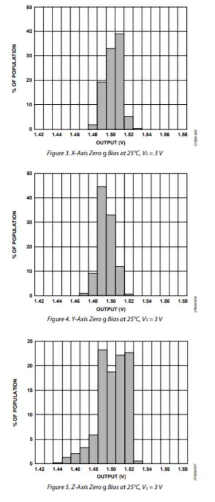

Figure 5 : Frequency of output voltage measurements from evaluation of Zero g Bias for all three axis[14].

 
The temperature range we expect to operate the sensor is around 23-28 degrees Celsius, as the average range of Carnegie Mellon University classrooms. The zero g bias voltage output for the x and y axis are expected to have a +/- 0.01 V change between 20-30 degrees Celsius, and almost no change in output between the same temperature range for the z-axis. We determine that the temperature (measured as temperature coefficient which is equal to change in acceleration readings in milli-g per change in temperature in degrees Celsius) does not significantly affect the sensor output for all three axis. We can expect the sensor performance and behavior to be relatively static in the testing temperature range. 

The accelerometer was powered through with the Raspberry Pi’s 3.3V source voltage. Sensitivity (in units of V/g) describes the mathematical relation between the phenomena, acceleration, and output voltage. The sensitivity of the sensor is also affected by temperature, however, for our purposes, a visual evaluation of the provided plots between temperature and sensitivity is sufficient to determine that sensitivity is consistent between 20-30 degrees Celsius. At 25 degrees Celsius and Vs = 3 volts, sensitivity is at about 0.303V/g for the X-axis, 0.305 V/g for the Y-axis, and 0.299 V/g for the Z-axis, averaging about 302 V/g. Sensitivity is linearly related to the source voltage, so at 3.3V, we calculate that the average sensitivity between the three axis is as follows:
3.3 V/ 3 V = (X V/g)/(302V/g) 
X V/g = 332.2 V/g

The measurement range indicates the expected range of inputs (magnitude and direction of the phenomena we are interested in, namely acceleration) we can have and still expect predictable and linear readings/outputs. According to the datasheet, the measurement range is 3g in both positive or negative directions, guaranteed by the manufacturer. The sensor also notably does not have significant cross-axis sensitivity to measure movement in non-orthogonal directions. Acceleration is an instantaneous reading, and we are more concerned about dynamic readings (acceleration over a short period of time), rather than static readings from tilt sensor applications. However, the sensor is designed to assess tilting motions as well, in the case of static acceleration. 

**Passive InfraRed Sensors (PIR)**

**Model: HC-SR501**

*Physical Principles*

PIR sensors are often used in motion-sensing applications such as security cameras in stores. The white bulbous shell that encapsulates the actual sensor is a Fresnel lens, which helps collect and concentrate light onto two pyroelectric sensors inside. One sensor has a positive output and the other has a negative output so they neutralize each other. When no motion is present, then the two sensors would read the same value (ambient IR in the testing environment) and have a zero output signal. When motion is detected, it will activate one sensor first, then the other (Figure 6). When there is motion in the opposite direction will generate an output pin high as a negative differential change between the two sensors[16].

  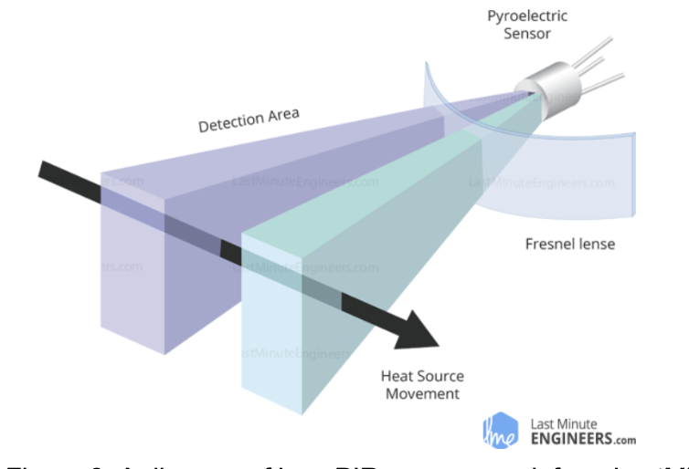

Figure 6: A diagram of how PIR sensors work from LastMinuteEngineers.com[17]

Pyroelectric sensors work by detecting electromagnetic radiation between 2 to 14 micrometers. They feature a pyroelectric crystal that is polarized to change with temperature. A crystal layer is embedded between electrodes (Figure 7) and topped off with a layer which absorbs infrared radiation that it interacts with. The pyroelectric crystal layer heats up and charges with this interaction; because the crystal is polarized, charges will move to opposite ends and create an electrical potential through the crystal[18].  

  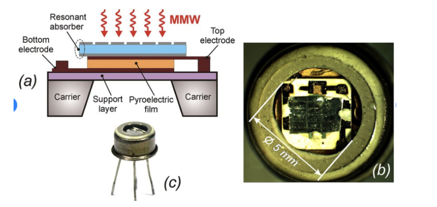

Figure  7: Diagrams from Research Gate depicting how pyroelectric sensors are constructed[19]

There are two potentiometers on the back of the PIR chip to control the sensitivity of the PIR and the delay time. The sensitivity of the PIR sensor is the sensing capability; the sensor can detect anywhere from between 3 to 7 meters, adjusted by the potentiometer. Delay time is the amount of time that the PIR sensor will remain high after being triggered by motion. It can help reduce redundant readings when counting fast-moving objects and provides flexibility in sensor setup. The delay time can be set to read high for 3 seconds to 5 minutes, and is always followed by 3 seconds of low output where no readings can be made. Another feature of the PIR sensor is the Trigger Mode[20], which has a Repeatable (H mode) and Single (L mode) option. The single trigger option means that the time delay begins when the motion is first detected, and ignores any additional triggers while remaining high for the rest of the delay time. Repeatable triggers mean that ever motion detection will reset the sensor’s delay time to restart count. This option is desirable for counting occurrences such as people entering a door. 

*Signal Characteristics and Dynamic/Static Behavior*

This PIR sensor features some signal conditioning and processing features built into the device. According to the PIR sensor datasheet, there is transmission rate of greater than 70% if the range of radiation detected averages between 7 to 14 micrometers (well within the IR spectrum). This means that 70% of the radiation incoming can be changed into electrical signals at or greater than 70% throughput. There is also a listed cut-on wavelength, at 5.0 +/- 0.5 micrometers. Within the  range of 4.5 and 5.5 microns, the transmission increases to and over 50% transmission, through a longpass optical filter. Longpass filters[21] are similar to highpass filters, in which shorter wavelengths are attenuated in from the signals received by a sensor while allowing longer wavelengths to pass. This is useful for PIR sensors since shorter wavelengths are within the visible light spectrum, which is almost always within the testing environment. 

The sensor also features an integrated circuit (BISS0001) that manages the trigger mode options (for repeatable and non-repeatable action). In Figure 8, the repeatable mode waveform is shown with three motions detected. Assuming that time proceeds from start time (T0) on the left edge of the diagram:
The first motion occurs at: shortly after T0
The second and third motions are one after the other and occur at: Tx+ Ti, and Tx+ Ti + Tx

  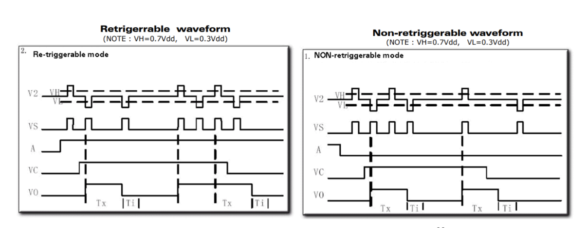

Figure 8: Repeatable and nonrepeatable waveform for PIR sensor[22].

The non-repeating waveform is shown with three motions as well, at the following time (same assumption as in the repeatable example above):
First and second motions occur one after the other at: shortly after T0, and shortly after Tx
Third motion occurs at: Tx+ Ti+ Tx
The first and second motions only trigger the sensor once, at the start of the first motion. The second motion is disregarded and no voltage output is generated from this interaction. The third motion generates voltage as normal after the delay time and the low-output time. 

**Light Sensor**

**Model: LM 393**

*Physical Principles*

Light sensors are equipped with a photoresistor (or LDR, light-dependent resistor) as the sensing unit, and circuits that can interpret changes in light into a series of electrical signals. The photoresistor embedded is model PDV-P9003, and are photoconductive photocells made of cadmium sulfide (CdS)[23]. 

Photoconductivity is the ability for a material to be more electrically conductive if it is exposed to light radiation, allowing more current to flow through[24]. As Ohm’s law dictates, current and resistance are inversely related, so resistance also decreases in photoconductive photocells with increase in light intensity. These photocells can sense light from 400 to 700 nm in the visible light spectrum; this means that radiation outside of this range will not affect resistance. To quantify resistance with respect to light intensity, quantitative values are expressed as illuminance, or the amount of light that is reflected/hits the surface of, in this case, the photocell. 

*Signal Characteristics and Static/Dynamic Behavior*

The cell’s resistance varies inversely with illuminance, as shown in the PDV-P9003 datasheet. From Sensitivity (resistance change in relation to luminance) declarations in the datasheet, the relationship is as follows in ohms per Lux:

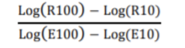 

The slope of the graph in Figure 9 is equal to the sensitivity of the sensor. The output voltage from the sensor can be related back to the resistance, which is then matched to the observed luminesce level, in lux .  

  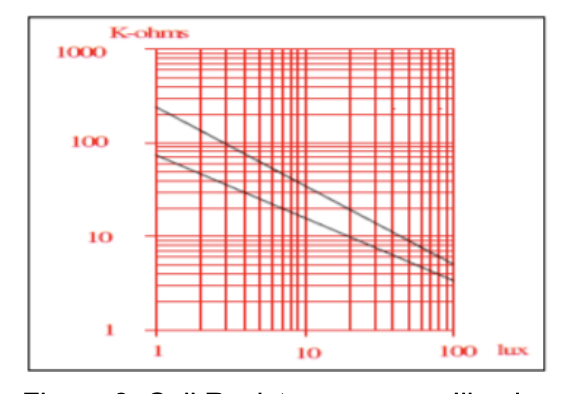

Figure 9: Cell Resistance versus Illuminance relationship 

normal operating temperatures. In this case, because we are using the sensor between 20-30 degrees Celsius, we don’t anticipate significant changes in expected output voltage from temperature factors. Ambient light from lamps in classrooms are also expected to be consistent. 

**Distance Sensor**

**Model: HC-SR04**

*Physical Principles digital*

Ultrasonic distance sensors can measure distance by outputting “chirps” of sound within the ultrasonic range, above the human hearing range. Humans can hear between 20 Hz to 20 kHz. Ultrasound has frequency above 20 kHzp[25]. 

Using the Trigger pin, the sensor starts the ranging/transmission process by outputting a 10 uS long pulse first as a trigger. The sensor would send out8  pulses at 40 kHz, which bounce off an object and are reflected back. Because we know the time that the pulses were sent out, and the speed of sound is a constant, distance of the object can be found as the product of the speed and time elapsed between sending and receiving the pulses. The Echo pin then outputs a signal for a time period proportional to the range. Range is found as uS/58 for range in centimeters, or the product of half the echo signal time and the speed of sound.

*Signal Characteristics and Static/Dynamic Behavior*

Sound waves are sinusoidal in nature and are characterized by frequency, wavelength, and amplitude. At 20 degrees Celsius, we know the speed of sound to be 343 meters per second but this can be changed by atmospheric humidity and temperature. Properties introduced by the air participles such as water vapor can obstruct and slow down the movement of sound waves in air, while temperature (related to relative energy and motion in particles) can do the same. Echo and trigger signals can be dynamic and affected by environmental factors. 

The timing diagram from the datasheet for the sensor shows that the trigger, burst and echo signals are fairly static and predictable, as shown in Figure 10.

  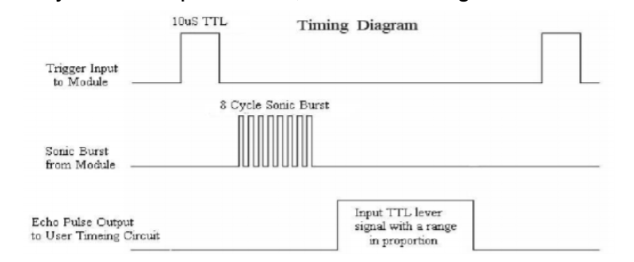

Figure 10: Timing diagram showing how distance is calculated from range[27]

**Force Sensitive Resistor**

**Model: MD30-60**

*Physical Principles*

Force sensitive resistors (FSR) changes its resistance with pressure. As it is a polymer thick film (PTF), FSRs are flexible, compact and versatile in usage. They are made of a semiconductor layer separated by a spacer from a layer with printed electrodes. When force is applied to the sensor, the semiconductor would contact the active electrode area.As force, measured in g, increases, resistance decreases in kilo-ohms, as shown in Figure 11. 

  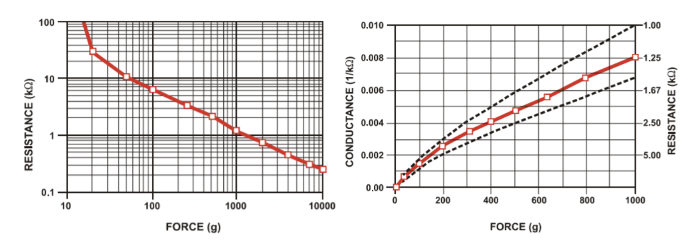

Figure 11: Relationships between resistance and force from the datasheet, in log/log scales. 11a (left), 11bv(right)[28] 

*Signal Characteristics and Static/Dynamic Behavior*

As shown in Figure 11, there is a short range between log 10 to log 100 g of force where the resistance drops from theoretically infinite kilo-ohms, to 10 kilo-ohms. The force required to reach the readable range of resistance is dependent on mainly the thickness of the sensor’s three layers and material. The error band (dotted lines in 11b) shows the expected accuracy for different force measurements. The greater the force measured, the less accurate resistance reading. 

### 2.3Signaling Processing and Conditioning

*Decision-Making Process*

We have two states of interest: door open, and door closed. The signal we expect to process is discrete and binary. Rather than calibrating each individual sensor to a ground truth, we decided to aggregate the results of 4 different sensors (accelerometer, light sensor, distance sensor and motion sensor) to detect whether the door was in one state or the other. The result of the four sensors is shown below.

## 5. Reference

[1]  Bicycle Helmet Safety Institute. “What's a g?” What Is a g? Acceleration?, Feb. 2019, [www.helmets.org/g.htm](https://www.helmets.org/g.htm).

[2] Orzel, Chad. “Football Physics: Putting G-Forces In Perspective.” Forbes, Forbes Magazine, 9 Nov. 2015, [www.forbes.com/sites/chadorzel/2015/11/08/football-physics-putting-g-forces-in-perspective/#40fc0a41766e](http://www.forbes.com/sites/chadorzel/2015/11/08/football-physics-putting-g-forces-in-perspective/#40fc0a41766e).

[3]Pederson, Tracy. “What Is Infrared?” LiveScience, Purch, 2019, [www.livescience.com/50260-infrared-radiation.html](http://www.livescience.com/50260-infrared-radiation.html).

[4] Libretexts. “Electromagnetic Radiation.” Chemistry LibreTexts, Libretexts, 5 June 2019, [chem.libretexts.org/Bookshelves/Physical_and_Theoretical_Chemistry_Textbook_Maps/Supplemental_Modules_(Physical_and_Theoretical_Chemistry)/Spectroscopy/Fundamentals_of_Spectroscopy/Electromagnetic_Radiation](https://chem.libretexts.org/Bookshelves/Physical_and_Theoretical_Chemistry_Textbook_Maps/Supplemental_Modules_(Physical_and_Theoretical_Chemistry)/Spectroscopy/Fundamentals_of_Spectroscopy/Electromagnetic_Radiation).

[5] Lee Shuk-Ming, Olivia. “Radiation Emitted by Human Body - Thermal Radiation.” Radiation, Sept. 2010, [www.hko.gov.hk/education/edu02rga/radiation/radiation_02-e.htm](http://www.hko.gov.hk/education/edu02rga/radiation/radiation_02-e.htm).

[6]  Radford, Max, and Francis Riemensperger. “The Electromagnetic Spectrum.” Mini Physics, 22 May 2016, [https://www.miniphysics.com/electromagnetic-spectrum_25.html).

[7] Smith, Daniel. “Calculating the Emission Spectra from Common Light Sources.” COMSOL Multiphysics, Jan. 2016, [www.comsol.com/blogs/calculating-the-emission-spectra-from-common-light-sources/](https://www.comsol.com/blogs/calculating-the-emission-spectra-from-common-light-sources/).

[8] LEC Expert. “Units of Light.” LEC, Nov. 2015, [www.lec-expert.com/topics/units-of-light](https://www.lec-expert.com/topics/units-of-light)

[9] Konica Minolta. “Luminance vs. Illuminance.” Konica Minolta Sensing Americas, 2019, [sensing.konicaminolta.us/blog/luminance-vs-illuminance/](https://sensing.konicaminolta.us/blog/luminance-vs-illuminance/).

[10] The Physics Classroom. “The Meaning of Force.” The Physics Classroom, 2019, [www.physicsclassroom.com/class/newtlaws/Lesson-2/The-Meaning-of-Force](https://www.physicsclassroom.com/class/newtlaws/Lesson-2/The-Meaning-of-Force).

[11] Ibrahim, Syed. “Static and Dynamic Forces.” Research Gate, Research Gate, Aug. 2014, [www.researchgate.net/publication/311807851_Static_and_dynamic_forces](https://www.researchgate.net/publication/311807851_Static_and_dynamic_forces).

[12] Analog Devices. “Small, Low Power, 3-Axis ±3 g Accelerometer Datasheet.” ADXL 335, 2010, [www.analog.com/media/en/technical-documentation/data-sheets/ADXL335.pdf](https://www.analog.com/media/en/technical-documentation/data-sheets/ADXL335.pdf).

[13] ElectronicsTutorial. “Introduction to Capacitors, Capacitance and Charge.” Basic Electronics Tutorials, 15 Sept. 2018, [www.electronics-tutorials.ws/capacitor/cap_1.html](https://www.electronics-tutorials.ws/capacitor/cap_1.html).

[14]Analog Devices. Small, Low Power, 3-Axis ±3 g Accelerometer. 2010, [www.analog.com/media/en/technical-documentation/data-sheets/ADXL335.pdf](https://www.analog.com/media/en/technical-documentation/data-sheets/ADXL335.pdf).

[15] Analog Devices. Accelerometer Specifications - Quick Definitions. [www.analog.com/en/products/landing-pages/001/accelerometer-specifications-definitions.html](https://www.analog.com/en/products/landing-pages/001/accelerometer-specifications-definitions.html).

[16]Ada, Lady. “PIR Motion Sensor.” Adafruit Learning System, [learn.adafruit.com/pir-passive-infrared-proximity-motion-sensor/how-pirs-work](https://learn.adafruit.com/pir-passive-infrared-proximity-motion-sensor/how-pirs-work).

[17]Last Minute Engineers. “How HC-SR501 PIR Sensor Works & How To Interface It With Arduino.” Last Minute Engineers, Last Minute Engineers, 7 Dec. 2018, [lastminuteengineers.com/pir-sensor-arduino-tutorial/](https://lastminuteengineers.com/pir-sensor-arduino-tutorial/).

[18] “Pyroelectricity.” ScienceDaily, ScienceDaily, [www.sciencedaily.com/terms/pyroelectricity.htm](https://www.sciencedaily.com/terms/pyroelectricity.htm).

[19]Navarro-Cia, Miguel. “Pyroelectric-Sensor-a-Sketch-of-the-Pyroelectric-Sensor-with-an-Integrated-Resonant.” Research Gate, Feb. 2016, [www.researchgate.net/figure/Pyroelectric-sensor-a-Sketch-of-the-pyroelectric-sensor-with-an-integrated-resonant_fig3_294873294](https://www.researchgate.net/figure/Pyroelectric-sensor-a-Sketch-of-the-pyroelectric-sensor-with-an-integrated-resonant_fig3_294873294).

[20]“Arduino HC-SR501 Motion Sensor Tutorial.” Henry's Bench, 10 Feb. 2018, [henrysbench.capnfatz.com/henrys-bench/arduino-sensors-and-input/arduino-hc-sr501-motion-sensor-tutorial/](http://henrysbench.capnfatz.com/henrys-bench/arduino-sensors-and-input/arduino-hc-sr501-motion-sensor-tutorial/).

[21] EO Edmund Optics. “Optical Filters: Edmund Optics.” Edmund Optics Worldwide, [www.edmundoptics.com/resources/application-notes/optics/optical-filters/](https://www.edmundoptics.com/resources/application-notes/optics/optical-filters/).

[22] Adafruit. “BISS0001 Micro Power PIR Motion Detector IC.” Adafruit Learn, [cdn-learn.adafruit.com/assets/assets/000/010/133/original/BISS0001.pdf](cdn-https://cdn-learn.adafruit.com/assets/assets/000/010/133/original/BISS0001.pdf).

[23]Luna Optoelectronics. “CDS Photoconductive Photocells.” Lunainc.com, 2016, [media.digikey.com/pdf/Data%20Sheets/Photonic%20Detetectors%20Inc%20PDFs/PDV-P9003.pdf](https://media.digikey.com/pdf/Data%20Sheets/Photonic%20Detetectors%20Inc%20PDFs/PDV-P9003.pdf).

[24]Pan, A., and X. Zhu. “Photoconductivity.” Photoconductivity - an Overview | ScienceDirect Topics, 2015, [www.sciencedirect.com/topics/chemistry/photoconductivity](https://www.sciencedirect.com/topics/chemistry/photoconductivity).

[25] Pujol, Rémy. “Journey into the World of Hearing - Specialists.” Cochlea- Hearing Ranges, 6 June 2018, [www.cochlea.org/en/hear/human-auditory-range](http://www.cochlea.org/en/hear/human-auditory-range).

[26] Burnett, Roderick. “Understanding How Ultrasonic Sensors Work.” MaxBotix Inc., Publisher Name MaxBotix Inc.Publisher Logo, 16 Sept. 2019, [www.maxbotix.com/articles/how-ultrasonic-sensors-work.htm](https://www.maxbotix.com/articles/how-ultrasonic-sensors-work.htm).

[27] LEC Freaks. Ultrasonic Ranging Module HC - SR04. Mouser Electronics, 2019, [www.mouser.com/datasheet/2/813/HCSR04-1022824.pdf](http://www.mouser.com/datasheet/2/813/HCSR04-1022824.pdf).

[28] Interlink Electronics. “Force Sensitive Resistor Integration Guide and Evaluation Parts Catalog.” 400 Series Evaluation Parts , [cdn-learn.adafruit.com/assets/assets/000/010/126/original/fsrguide.pdf](https://cdn-learn.adafruit.com/assets/assets/000/010/126/original/fsrguide.pdf).

**Tutorials and References for Sensors:**

Krishnan, Hari, et al. “3 Axis Accelerometer with Regulator – ADXL335.” RhydoLABZwiki, 20 July 2013, [http://www.rhydolabz.com/wiki/?p=1417](http://www.rhydolabz.com/wiki/?p=1417).

DroneBot Workshop. “HC-SR501 with Arduino & Raspberry Pi.” DroneBot Workshop, Publisher Name DroneBot Workshop Publisher Logo, 24 June 2019, [https://dronebotworkshop.com/using-pir-sensors-with-arduino-raspberry-pi/](https://dronebotworkshop.com/using-pir-sensors-with-arduino-raspberry-pi/)

Caird, Andrew. “Using a Force Sensitive Resistor with a Raspberry Pi Which I Couldn't Find Anywhere Else on the Internets, so I Had to Write This.” Sitewide ATOM, Jan. 2015, [https://acaird.github.io/computers/2015/01/07/raspberry-pi-fsr](https://acaird.github.io/computers/2015/01/07/raspberry-pi-fsr)

Berges, Mario. “3. Reading Analog Signals with an ADC.” Tutorials for 12740, 2019, [https://inferlab.github.io/12740/tutorials/adc.html](https://inferlab.github.io/12740/tutorials/adc.html)

“Interface PIR Motion Sensor with Raspberry Pi.” How to Interface and Program an HC-SR501 PIR Motion Sensor to the Raspberry Pi, [www.mbtechworks.com/projects/pir-motion-sensor-with-raspberry-pi.html](www.mbtechworks.com/projects/pir-motion-sensor-with-raspberry-pi.html).

Anavi, Leon. “Detecting Distance on Raspberry Pi with HC-SR04.” Leon Anavi - Mobile & Embedded, [https://www.anavi.org/article/209/](https://www.anavi.org/article/209/).

